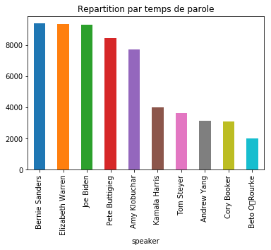
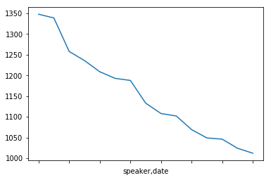

# <font color='Violet'> <u> DEEP LEARNING ON USA DEMOCRATES DEBATE   </u></font>
## **By Pamela Dekas**


```python
import sys
import csv
import re 
import nltk
import string
import unicodedata
from textblob import TextBlob
from collections import Counter
import pandas as pd
import numpy as np
from wordcloud import WordCloud
from nltk.classify import * 
from nltk.corpus import stopwords
from sklearn.metrics import f1_score, roc_auc_score
from sklearn.feature_extraction.text import CountVectorizer
from nltk.tokenize import word_tokenize
import nltk.classify.util
import matplotlib.pyplot as plt
from string import punctuation 
from nltk.corpus import stopwords
from wordcloud import STOPWORDS
import os
from sklearn.model_selection import train_test_split
from keras.datasets import imdb
from keras.models import Sequential
from keras.layers import Dense
from keras.layers import LSTM
from keras.layers.embeddings import Embedding
from keras.preprocessing import sequence, text
from keras.callbacks import EarlyStopping
```

    Using TensorFlow backend.
    


    ---------------------------------------------------------------------------

    AttributeError                            Traceback (most recent call last)

    <ipython-input-23-8e467506ca85> in <module>()
         22 import os
         23 from sklearn.model_selection import train_test_split
    ---> 24 from keras.datasets import imdb
         25 from keras.models import Sequential
         26 from keras.layers import Dense
    

    ~\Anaconda3\lib\site-packages\keras\__init__.py in <module>()
          1 from __future__ import absolute_import
          2 
    ----> 3 from . import utils
          4 from . import activations
          5 from . import applications
    

    ~\Anaconda3\lib\site-packages\keras\utils\__init__.py in <module>()
          4 from . import data_utils
          5 from . import io_utils
    ----> 6 from . import conv_utils
          7 from . import losses_utils
          8 from . import metrics_utils
    

    ~\Anaconda3\lib\site-packages\keras\utils\conv_utils.py in <module>()
          7 from six.moves import range
          8 import numpy as np
    ----> 9 from .. import backend as K
         10 
         11 
    

    ~\Anaconda3\lib\site-packages\keras\backend\__init__.py in <module>()
    ----> 1 from .load_backend import epsilon
          2 from .load_backend import set_epsilon
          3 from .load_backend import floatx
          4 from .load_backend import set_floatx
          5 from .load_backend import cast_to_floatx
    

    ~\Anaconda3\lib\site-packages\keras\backend\load_backend.py in <module>()
         88 elif _BACKEND == 'tensorflow':
         89     sys.stderr.write('Using TensorFlow backend.\n')
    ---> 90     from .tensorflow_backend import *
         91 else:
         92     # Try and load external backend.
    

    ~\Anaconda3\lib\site-packages\keras\backend\tensorflow_backend.py in <module>()
         52 
         53 # Private TF Keras utils
    ---> 54 get_graph = tf_keras_backend.get_graph
         55 # learning_phase_scope = tf_keras_backend.learning_phase_scope  # TODO
         56 name_scope = tf.name_scope
    

    AttributeError: module 'tensorflow.python.keras.backend' has no attribute 'get_graph'


```python
speech = pd.read_csv('debate_transcripts_v3_2020-02-26.csv',encoding= 'unicode_escape')
```


```python
df= pd.DataFrame(speech)
dem_speakers = df["speaker"]
number_of_speakers = len(set(dem_speakers))
print("Nombre de speakers:",number_of_speakers, "speakers")

# Mean duration of speech.
print("temps moyen de parole:",np.mean(df["speaking_time_seconds"]), "seconds")
print("Dataset size:", len(df))
```

    Nombre de speakers: 106 speakers
    temps moyen de parole: 16.49230769230769 seconds
    Dataset size: 5911
    


```python
df.info()
```

    <class 'pandas.core.frame.DataFrame'>
    RangeIndex: 5911 entries, 0 to 5910
    Data columns (total 6 columns):
    date                     5911 non-null object
    debate_name              5911 non-null object
    debate_section           5911 non-null object
    speaker                  5911 non-null object
    speech                   5911 non-null object
    speaking_time_seconds    5395 non-null float64
    dtypes: float64(1), object(5)
    memory usage: 277.2+ KB
    


```python
df.groupby('speaker')['speaking_time_seconds'].sum(level=0).nlargest(10).plot.bar()
plt.title('Repartition par temps de parole')
plt.show()
```


    

    


```python
debate_time = df.groupby(by=['speaker', 'date']).speaking_time_seconds.sum().nlargest(15)
debate_time.plot()
```


    <matplotlib.axes._subplots.AxesSubplot at 0x1fb130c3198>


    

    


### suppresion des colonnes qui ne seront pas utilisé dans la suite du projet et creation du dataset final###


```python
df=df.drop(['date','debate_name','debate_section','speaking_time_seconds'],1)
df.head(5)
```


<div>
<style scoped>
    .dataframe tbody tr th:only-of-type {
        vertical-align: middle;
    }

    .dataframe tbody tr th {
        vertical-align: top;
    }

    .dataframe thead th {
        text-align: right;
    }
</style>
<table border="1" class="dataframe">
  <thead>
    <tr style="text-align: right;">
      <th></th>
      <th>speaker</th>
      <th>speech</th>
    </tr>
  </thead>
  <tbody>
    <tr>
      <th>0</th>
      <td>Norah O’Donnell</td>
      <td>Good evening and welcome, the Democratic presi...</td>
    </tr>
    <tr>
      <th>1</th>
      <td>Gayle King</td>
      <td>And Super Tuesday is just a week away and this...</td>
    </tr>
    <tr>
      <th>2</th>
      <td>Norah O’Donnell</td>
      <td>And CBS News is proud to bring you this debate...</td>
    </tr>
    <tr>
      <th>3</th>
      <td>Gayle King</td>
      <td>And we are partnering tonight also with Twitte...</td>
    </tr>
    <tr>
      <th>4</th>
      <td>Norah O’Donnell</td>
      <td>Now, here are the rules for the next two hours...</td>
    </tr>
  </tbody>
</table>
</div>


  <font color='Violet'> <u> PREPROCESSING  </u></font>


```python
import nltk 
nltk.download('punkt')
stopwords = nltk.corpus.stopwords.words('english')
Tailored_stopwords=('im','ive','mr','weve','dont','well','will','make','us','we',
                      'I','make','got','need','want','think',
                      'going','go','one','thank','going',
                      'way','say','every','re','us','first',
                     'now','said','know','look','done','take',
                     'number','two','three','s','m',"t",
                      'let','don','tell','ve','im','mr','put','maybe','whether','many', 'll','around','thing','Secondly','doesn','lot')
#stopwords = nltk.corpus.stopwords.words('english')
stopwords = set(STOPWORDS)
stopwords= stopwords.union(Tailored_stopwords)
```

    [nltk_data] Downloading package punkt to C:\Users\pamel.DESKTOP-O19M7N
    [nltk_data]     F\AppData\Roaming\nltk_data...
    [nltk_data]   Package punkt is already up-to-date!
    


```python
def Text_cleansing(speech):
    speech = re.sub('@[A-Za-z0–9]+', '', str(speech))
    speech = re.sub('#', '', speech) # Enlever les '#' hash tag
    speech = re.sub('rt', '', speech)
    speech=re.sub(',',' ', speech)
    speech=re.sub('!',' ',speech)
    speech=re.sub(':',' ',speech)
    speech=re.sub("'","",speech)
    speech=re.sub('"','',speech)
    speech=speech.lower()
    speech = word_tokenize(speech)
    return speech
```


```python
def remove_stopwords(speech):
    speech_clean = [word for word in speech if word not in stopwords]
    return speech_clean
                         
```


```python
df['speech_tokens']= df['speech'].apply(Text_cleansing)
df.head(5)
```


<div>
<style scoped>
    .dataframe tbody tr th:only-of-type {
        vertical-align: middle;
    }

    .dataframe tbody tr th {
        vertical-align: top;
    }

    .dataframe thead th {
        text-align: right;
    }
</style>
<table border="1" class="dataframe">
  <thead>
    <tr style="text-align: right;">
      <th></th>
      <th>speaker</th>
      <th>speech</th>
      <th>speech_tokens</th>
    </tr>
  </thead>
  <tbody>
    <tr>
      <th>0</th>
      <td>Norah O’Donnell</td>
      <td>Good evening and welcome, the Democratic presi...</td>
      <td>[good, evening, and, welcome, the, democratic,...</td>
    </tr>
    <tr>
      <th>1</th>
      <td>Gayle King</td>
      <td>And Super Tuesday is just a week away and this...</td>
      <td>[and, super, tuesday, is, just, a, week, away,...</td>
    </tr>
    <tr>
      <th>2</th>
      <td>Norah O’Donnell</td>
      <td>And CBS News is proud to bring you this debate...</td>
      <td>[and, cbs, news, is, proud, to, bring, you, th...</td>
    </tr>
    <tr>
      <th>3</th>
      <td>Gayle King</td>
      <td>And we are partnering tonight also with Twitte...</td>
      <td>[and, we, are, panering, tonight, also, with, ...</td>
    </tr>
    <tr>
      <th>4</th>
      <td>Norah O’Donnell</td>
      <td>Now, here are the rules for the next two hours...</td>
      <td>[now, here, are, the, rules, for, the, next, t...</td>
    </tr>
  </tbody>
</table>
</div>


```python
df['speech_clean']=df['speech_tokens'].apply(remove_stopwords)
df.head(5)
```


<div>
<style scoped>
    .dataframe tbody tr th:only-of-type {
        vertical-align: middle;
    }

    .dataframe tbody tr th {
        vertical-align: top;
    }

    .dataframe thead th {
        text-align: right;
    }
</style>
<table border="1" class="dataframe">
  <thead>
    <tr style="text-align: right;">
      <th></th>
      <th>speaker</th>
      <th>speech</th>
      <th>speech_tokens</th>
      <th>speech_clean</th>
    </tr>
  </thead>
  <tbody>
    <tr>
      <th>0</th>
      <td>Norah O’Donnell</td>
      <td>Good evening and welcome, the Democratic presi...</td>
      <td>[good, evening, and, welcome, the, democratic,...</td>
      <td>[good, evening, welcome, democratic, president...</td>
    </tr>
    <tr>
      <th>1</th>
      <td>Gayle King</td>
      <td>And Super Tuesday is just a week away and this...</td>
      <td>[and, super, tuesday, is, just, a, week, away,...</td>
      <td>[super, tuesday, week, away, biggest, primary,...</td>
    </tr>
    <tr>
      <th>2</th>
      <td>Norah O’Donnell</td>
      <td>And CBS News is proud to bring you this debate...</td>
      <td>[and, cbs, news, is, proud, to, bring, you, th...</td>
      <td>[cbs, news, proud, bring, debate, along, co-sp...</td>
    </tr>
    <tr>
      <th>3</th>
      <td>Gayle King</td>
      <td>And we are partnering tonight also with Twitte...</td>
      <td>[and, we, are, panering, tonight, also, with, ...</td>
      <td>[panering, tonight, twitter, ., home, paicipat...</td>
    </tr>
    <tr>
      <th>4</th>
      <td>Norah O’Donnell</td>
      <td>Now, here are the rules for the next two hours...</td>
      <td>[now, here, are, the, rules, for, the, next, t...</td>
      <td>[rules, next, hours, ., asked, question, minut...</td>
    </tr>
  </tbody>
</table>
</div>


```python
def wordcloud(dataframe):
    Aw= df['speech_clean']
    wordCloud = WordCloud(width=500, height=300,background_color='white', max_font_size=110).generate(str(Aw))
    plt.imshow(wordCloud, interpolation="bilinear")
    plt.axis("off")
    plt.title("speech wordcloud")

wordcloud(df['speech_clean'])
```


    

    


### Pour la suite du projet on reduira la liste des speakers aux candidats les plus notoires (top 7 speakers)###


```python
df = df.loc[df.speaker.isin({'Joe Biden', 'Bernie Sanders', 'Elizabeth Warren', 'Michael Bloomberg', 'Pete Buttigieg', 'Amy Klobuchar',  'Tulsi Gabbard'})]
df.head()
df.shape
```


    (2245, 4)


### CountVectorizer et creation du dict des mots par candidat a utiliser sur les modeles ML qui seront en back-up###

### Analyse Lexicale ###


```python
cv = CountVectorizer(stop_words=stopwords)
df_cv = cv.fit_transform(df.speech)
df_words = pd.DataFrame(df_cv.toarray(), columns=cv.get_feature_names())
df_words.index = df.speaker
df_words = df_words.transpose()
df_words
```


<div>
<style scoped>
    .dataframe tbody tr th:only-of-type {
        vertical-align: middle;
    }

    .dataframe tbody tr th {
        vertical-align: top;
    }

    .dataframe thead th {
        text-align: right;
    }
</style>
<table border="1" class="dataframe">
  <thead>
    <tr style="text-align: right;">
      <th>speaker</th>
      <th>Bernie Sanders</th>
      <th>Michael Bloomberg</th>
      <th>Michael Bloomberg</th>
      <th>Bernie Sanders</th>
      <th>Pete Buttigieg</th>
      <th>Elizabeth Warren</th>
      <th>Elizabeth Warren</th>
      <th>Pete Buttigieg</th>
      <th>Joe Biden</th>
      <th>Bernie Sanders</th>
      <th>...</th>
      <th>Amy Klobuchar</th>
      <th>Elizabeth Warren</th>
      <th>Amy Klobuchar</th>
      <th>Tulsi Gabbard</th>
      <th>Tulsi Gabbard</th>
      <th>Amy Klobuchar</th>
      <th>Amy Klobuchar</th>
      <th>Amy Klobuchar</th>
      <th>Elizabeth Warren</th>
      <th>Elizabeth Warren</th>
    </tr>
  </thead>
  <tbody>
    <tr>
      <th>00</th>
      <td>0</td>
      <td>0</td>
      <td>0</td>
      <td>0</td>
      <td>0</td>
      <td>0</td>
      <td>0</td>
      <td>0</td>
      <td>0</td>
      <td>0</td>
      <td>...</td>
      <td>0</td>
      <td>0</td>
      <td>0</td>
      <td>0</td>
      <td>0</td>
      <td>0</td>
      <td>0</td>
      <td>0</td>
      <td>0</td>
      <td>0</td>
    </tr>
    <tr>
      <th>000</th>
      <td>2</td>
      <td>0</td>
      <td>0</td>
      <td>0</td>
      <td>0</td>
      <td>0</td>
      <td>0</td>
      <td>0</td>
      <td>0</td>
      <td>0</td>
      <td>...</td>
      <td>0</td>
      <td>0</td>
      <td>0</td>
      <td>0</td>
      <td>0</td>
      <td>0</td>
      <td>0</td>
      <td>0</td>
      <td>0</td>
      <td>0</td>
    </tr>
    <tr>
      <th>001st</th>
      <td>0</td>
      <td>0</td>
      <td>0</td>
      <td>0</td>
      <td>0</td>
      <td>0</td>
      <td>0</td>
      <td>0</td>
      <td>0</td>
      <td>0</td>
      <td>...</td>
      <td>0</td>
      <td>0</td>
      <td>0</td>
      <td>0</td>
      <td>0</td>
      <td>0</td>
      <td>0</td>
      <td>0</td>
      <td>0</td>
      <td>0</td>
    </tr>
    <tr>
      <th>01</th>
      <td>0</td>
      <td>0</td>
      <td>0</td>
      <td>0</td>
      <td>0</td>
      <td>0</td>
      <td>0</td>
      <td>0</td>
      <td>0</td>
      <td>0</td>
      <td>...</td>
      <td>0</td>
      <td>0</td>
      <td>0</td>
      <td>0</td>
      <td>0</td>
      <td>0</td>
      <td>0</td>
      <td>0</td>
      <td>0</td>
      <td>0</td>
    </tr>
    <tr>
      <th>02</th>
      <td>0</td>
      <td>0</td>
      <td>0</td>
      <td>0</td>
      <td>0</td>
      <td>0</td>
      <td>0</td>
      <td>0</td>
      <td>0</td>
      <td>0</td>
      <td>...</td>
      <td>0</td>
      <td>0</td>
      <td>0</td>
      <td>0</td>
      <td>0</td>
      <td>0</td>
      <td>0</td>
      <td>0</td>
      <td>0</td>
      <td>0</td>
    </tr>
    <tr>
      <th>03</th>
      <td>0</td>
      <td>0</td>
      <td>0</td>
      <td>0</td>
      <td>0</td>
      <td>0</td>
      <td>0</td>
      <td>0</td>
      <td>0</td>
      <td>0</td>
      <td>...</td>
      <td>0</td>
      <td>0</td>
      <td>0</td>
      <td>0</td>
      <td>0</td>
      <td>0</td>
      <td>0</td>
      <td>0</td>
      <td>0</td>
      <td>0</td>
    </tr>
    <tr>
      <th>04</th>
      <td>0</td>
      <td>0</td>
      <td>0</td>
      <td>0</td>
      <td>0</td>
      <td>0</td>
      <td>0</td>
      <td>0</td>
      <td>0</td>
      <td>0</td>
      <td>...</td>
      <td>0</td>
      <td>0</td>
      <td>0</td>
      <td>0</td>
      <td>0</td>
      <td>0</td>
      <td>0</td>
      <td>0</td>
      <td>0</td>
      <td>0</td>
    </tr>
    <tr>
      <th>05</th>
      <td>0</td>
      <td>0</td>
      <td>0</td>
      <td>0</td>
      <td>0</td>
      <td>0</td>
      <td>0</td>
      <td>0</td>
      <td>0</td>
      <td>0</td>
      <td>...</td>
      <td>0</td>
      <td>0</td>
      <td>0</td>
      <td>0</td>
      <td>0</td>
      <td>0</td>
      <td>0</td>
      <td>0</td>
      <td>0</td>
      <td>0</td>
    </tr>
    <tr>
      <th>06</th>
      <td>0</td>
      <td>0</td>
      <td>0</td>
      <td>0</td>
      <td>0</td>
      <td>0</td>
      <td>0</td>
      <td>0</td>
      <td>0</td>
      <td>0</td>
      <td>...</td>
      <td>0</td>
      <td>0</td>
      <td>0</td>
      <td>0</td>
      <td>0</td>
      <td>0</td>
      <td>0</td>
      <td>0</td>
      <td>0</td>
      <td>0</td>
    </tr>
    <tr>
      <th>07</th>
      <td>0</td>
      <td>0</td>
      <td>0</td>
      <td>0</td>
      <td>0</td>
      <td>0</td>
      <td>0</td>
      <td>0</td>
      <td>0</td>
      <td>0</td>
      <td>...</td>
      <td>0</td>
      <td>0</td>
      <td>0</td>
      <td>0</td>
      <td>0</td>
      <td>0</td>
      <td>0</td>
      <td>0</td>
      <td>0</td>
      <td>0</td>
    </tr>
    <tr>
      <th>08</th>
      <td>0</td>
      <td>0</td>
      <td>0</td>
      <td>0</td>
      <td>0</td>
      <td>0</td>
      <td>0</td>
      <td>0</td>
      <td>0</td>
      <td>0</td>
      <td>...</td>
      <td>0</td>
      <td>0</td>
      <td>0</td>
      <td>0</td>
      <td>0</td>
      <td>0</td>
      <td>0</td>
      <td>0</td>
      <td>0</td>
      <td>0</td>
    </tr>
    <tr>
      <th>09</th>
      <td>0</td>
      <td>0</td>
      <td>0</td>
      <td>0</td>
      <td>0</td>
      <td>0</td>
      <td>0</td>
      <td>0</td>
      <td>0</td>
      <td>0</td>
      <td>...</td>
      <td>0</td>
      <td>0</td>
      <td>0</td>
      <td>0</td>
      <td>0</td>
      <td>0</td>
      <td>0</td>
      <td>0</td>
      <td>0</td>
      <td>0</td>
    </tr>
    <tr>
      <th>10</th>
      <td>0</td>
      <td>0</td>
      <td>0</td>
      <td>0</td>
      <td>0</td>
      <td>0</td>
      <td>0</td>
      <td>0</td>
      <td>0</td>
      <td>0</td>
      <td>...</td>
      <td>0</td>
      <td>0</td>
      <td>0</td>
      <td>0</td>
      <td>0</td>
      <td>0</td>
      <td>0</td>
      <td>0</td>
      <td>0</td>
      <td>0</td>
    </tr>
    <tr>
      <th>100</th>
      <td>0</td>
      <td>0</td>
      <td>0</td>
      <td>0</td>
      <td>0</td>
      <td>0</td>
      <td>0</td>
      <td>0</td>
      <td>0</td>
      <td>0</td>
      <td>...</td>
      <td>0</td>
      <td>0</td>
      <td>0</td>
      <td>0</td>
      <td>0</td>
      <td>0</td>
      <td>0</td>
      <td>0</td>
      <td>0</td>
      <td>0</td>
    </tr>
    <tr>
      <th>10000</th>
      <td>0</td>
      <td>0</td>
      <td>0</td>
      <td>0</td>
      <td>0</td>
      <td>0</td>
      <td>0</td>
      <td>0</td>
      <td>0</td>
      <td>0</td>
      <td>...</td>
      <td>0</td>
      <td>0</td>
      <td>0</td>
      <td>0</td>
      <td>0</td>
      <td>0</td>
      <td>0</td>
      <td>0</td>
      <td>0</td>
      <td>0</td>
    </tr>
    <tr>
      <th>100s</th>
      <td>0</td>
      <td>0</td>
      <td>0</td>
      <td>0</td>
      <td>0</td>
      <td>0</td>
      <td>0</td>
      <td>0</td>
      <td>0</td>
      <td>0</td>
      <td>...</td>
      <td>0</td>
      <td>0</td>
      <td>0</td>
      <td>0</td>
      <td>0</td>
      <td>0</td>
      <td>0</td>
      <td>0</td>
      <td>0</td>
      <td>0</td>
    </tr>
    <tr>
      <th>10th</th>
      <td>0</td>
      <td>0</td>
      <td>0</td>
      <td>0</td>
      <td>0</td>
      <td>0</td>
      <td>0</td>
      <td>0</td>
      <td>0</td>
      <td>0</td>
      <td>...</td>
      <td>0</td>
      <td>0</td>
      <td>0</td>
      <td>0</td>
      <td>0</td>
      <td>0</td>
      <td>0</td>
      <td>0</td>
      <td>0</td>
      <td>0</td>
    </tr>
    <tr>
      <th>11</th>
      <td>0</td>
      <td>0</td>
      <td>0</td>
      <td>0</td>
      <td>0</td>
      <td>0</td>
      <td>0</td>
      <td>0</td>
      <td>0</td>
      <td>0</td>
      <td>...</td>
      <td>0</td>
      <td>0</td>
      <td>0</td>
      <td>0</td>
      <td>0</td>
      <td>0</td>
      <td>0</td>
      <td>0</td>
      <td>0</td>
      <td>0</td>
    </tr>
    <tr>
      <th>12</th>
      <td>0</td>
      <td>0</td>
      <td>0</td>
      <td>0</td>
      <td>0</td>
      <td>0</td>
      <td>0</td>
      <td>0</td>
      <td>1</td>
      <td>0</td>
      <td>...</td>
      <td>0</td>
      <td>0</td>
      <td>0</td>
      <td>0</td>
      <td>0</td>
      <td>0</td>
      <td>0</td>
      <td>0</td>
      <td>0</td>
      <td>0</td>
    </tr>
    <tr>
      <th>120</th>
      <td>0</td>
      <td>0</td>
      <td>0</td>
      <td>0</td>
      <td>0</td>
      <td>0</td>
      <td>0</td>
      <td>0</td>
      <td>0</td>
      <td>0</td>
      <td>...</td>
      <td>0</td>
      <td>0</td>
      <td>0</td>
      <td>0</td>
      <td>0</td>
      <td>0</td>
      <td>0</td>
      <td>0</td>
      <td>0</td>
      <td>0</td>
    </tr>
    <tr>
      <th>125</th>
      <td>0</td>
      <td>0</td>
      <td>0</td>
      <td>0</td>
      <td>0</td>
      <td>0</td>
      <td>0</td>
      <td>0</td>
      <td>0</td>
      <td>0</td>
      <td>...</td>
      <td>0</td>
      <td>0</td>
      <td>0</td>
      <td>0</td>
      <td>0</td>
      <td>0</td>
      <td>0</td>
      <td>0</td>
      <td>0</td>
      <td>0</td>
    </tr>
    <tr>
      <th>12th</th>
      <td>0</td>
      <td>0</td>
      <td>0</td>
      <td>0</td>
      <td>0</td>
      <td>0</td>
      <td>0</td>
      <td>0</td>
      <td>0</td>
      <td>0</td>
      <td>...</td>
      <td>0</td>
      <td>0</td>
      <td>0</td>
      <td>0</td>
      <td>0</td>
      <td>0</td>
      <td>0</td>
      <td>0</td>
      <td>0</td>
      <td>0</td>
    </tr>
    <tr>
      <th>13</th>
      <td>0</td>
      <td>0</td>
      <td>0</td>
      <td>0</td>
      <td>0</td>
      <td>0</td>
      <td>0</td>
      <td>0</td>
      <td>0</td>
      <td>0</td>
      <td>...</td>
      <td>0</td>
      <td>0</td>
      <td>0</td>
      <td>0</td>
      <td>0</td>
      <td>0</td>
      <td>0</td>
      <td>0</td>
      <td>0</td>
      <td>0</td>
    </tr>
    <tr>
      <th>130</th>
      <td>0</td>
      <td>0</td>
      <td>0</td>
      <td>0</td>
      <td>0</td>
      <td>0</td>
      <td>0</td>
      <td>0</td>
      <td>0</td>
      <td>0</td>
      <td>...</td>
      <td>0</td>
      <td>0</td>
      <td>0</td>
      <td>0</td>
      <td>0</td>
      <td>0</td>
      <td>0</td>
      <td>0</td>
      <td>0</td>
      <td>0</td>
    </tr>
    <tr>
      <th>135</th>
      <td>0</td>
      <td>0</td>
      <td>0</td>
      <td>0</td>
      <td>0</td>
      <td>0</td>
      <td>0</td>
      <td>0</td>
      <td>0</td>
      <td>0</td>
      <td>...</td>
      <td>0</td>
      <td>0</td>
      <td>0</td>
      <td>0</td>
      <td>0</td>
      <td>0</td>
      <td>0</td>
      <td>0</td>
      <td>0</td>
      <td>0</td>
    </tr>
    <tr>
      <th>137</th>
      <td>0</td>
      <td>0</td>
      <td>0</td>
      <td>0</td>
      <td>0</td>
      <td>0</td>
      <td>0</td>
      <td>0</td>
      <td>0</td>
      <td>0</td>
      <td>...</td>
      <td>0</td>
      <td>0</td>
      <td>0</td>
      <td>0</td>
      <td>0</td>
      <td>0</td>
      <td>0</td>
      <td>0</td>
      <td>0</td>
      <td>0</td>
    </tr>
    <tr>
      <th>13th</th>
      <td>0</td>
      <td>0</td>
      <td>0</td>
      <td>0</td>
      <td>0</td>
      <td>0</td>
      <td>0</td>
      <td>0</td>
      <td>0</td>
      <td>0</td>
      <td>...</td>
      <td>0</td>
      <td>0</td>
      <td>0</td>
      <td>0</td>
      <td>0</td>
      <td>0</td>
      <td>0</td>
      <td>0</td>
      <td>0</td>
      <td>0</td>
    </tr>
    <tr>
      <th>14</th>
      <td>0</td>
      <td>0</td>
      <td>0</td>
      <td>0</td>
      <td>0</td>
      <td>0</td>
      <td>0</td>
      <td>0</td>
      <td>0</td>
      <td>0</td>
      <td>...</td>
      <td>0</td>
      <td>0</td>
      <td>0</td>
      <td>0</td>
      <td>0</td>
      <td>0</td>
      <td>0</td>
      <td>0</td>
      <td>0</td>
      <td>0</td>
    </tr>
    <tr>
      <th>140</th>
      <td>0</td>
      <td>0</td>
      <td>0</td>
      <td>0</td>
      <td>0</td>
      <td>0</td>
      <td>0</td>
      <td>0</td>
      <td>0</td>
      <td>0</td>
      <td>...</td>
      <td>0</td>
      <td>0</td>
      <td>0</td>
      <td>0</td>
      <td>0</td>
      <td>0</td>
      <td>0</td>
      <td>0</td>
      <td>0</td>
      <td>0</td>
    </tr>
    <tr>
      <th>149</th>
      <td>0</td>
      <td>0</td>
      <td>0</td>
      <td>0</td>
      <td>0</td>
      <td>0</td>
      <td>0</td>
      <td>0</td>
      <td>0</td>
      <td>0</td>
      <td>...</td>
      <td>0</td>
      <td>0</td>
      <td>0</td>
      <td>0</td>
      <td>0</td>
      <td>0</td>
      <td>0</td>
      <td>0</td>
      <td>0</td>
      <td>0</td>
    </tr>
    <tr>
      <th>...</th>
      <td>...</td>
      <td>...</td>
      <td>...</td>
      <td>...</td>
      <td>...</td>
      <td>...</td>
      <td>...</td>
      <td>...</td>
      <td>...</td>
      <td>...</td>
      <td>...</td>
      <td>...</td>
      <td>...</td>
      <td>...</td>
      <td>...</td>
      <td>...</td>
      <td>...</td>
      <td>...</td>
      <td>...</td>
      <td>...</td>
      <td>...</td>
    </tr>
    <tr>
      <th>xinjiang</th>
      <td>0</td>
      <td>0</td>
      <td>0</td>
      <td>0</td>
      <td>0</td>
      <td>0</td>
      <td>0</td>
      <td>0</td>
      <td>0</td>
      <td>0</td>
      <td>...</td>
      <td>0</td>
      <td>0</td>
      <td>0</td>
      <td>0</td>
      <td>0</td>
      <td>0</td>
      <td>0</td>
      <td>0</td>
      <td>0</td>
      <td>0</td>
    </tr>
    <tr>
      <th>yachts</th>
      <td>0</td>
      <td>0</td>
      <td>0</td>
      <td>0</td>
      <td>0</td>
      <td>0</td>
      <td>0</td>
      <td>0</td>
      <td>0</td>
      <td>0</td>
      <td>...</td>
      <td>0</td>
      <td>0</td>
      <td>0</td>
      <td>0</td>
      <td>0</td>
      <td>0</td>
      <td>0</td>
      <td>0</td>
      <td>0</td>
      <td>0</td>
    </tr>
    <tr>
      <th>yale</th>
      <td>0</td>
      <td>0</td>
      <td>0</td>
      <td>0</td>
      <td>0</td>
      <td>0</td>
      <td>0</td>
      <td>0</td>
      <td>0</td>
      <td>0</td>
      <td>...</td>
      <td>0</td>
      <td>0</td>
      <td>0</td>
      <td>0</td>
      <td>0</td>
      <td>0</td>
      <td>0</td>
      <td>0</td>
      <td>0</td>
      <td>0</td>
    </tr>
    <tr>
      <th>yang</th>
      <td>0</td>
      <td>0</td>
      <td>0</td>
      <td>0</td>
      <td>0</td>
      <td>0</td>
      <td>0</td>
      <td>0</td>
      <td>0</td>
      <td>0</td>
      <td>...</td>
      <td>0</td>
      <td>0</td>
      <td>0</td>
      <td>0</td>
      <td>0</td>
      <td>0</td>
      <td>0</td>
      <td>0</td>
      <td>0</td>
      <td>0</td>
    </tr>
    <tr>
      <th>yanked</th>
      <td>0</td>
      <td>0</td>
      <td>0</td>
      <td>0</td>
      <td>0</td>
      <td>0</td>
      <td>0</td>
      <td>0</td>
      <td>0</td>
      <td>0</td>
      <td>...</td>
      <td>0</td>
      <td>0</td>
      <td>0</td>
      <td>0</td>
      <td>0</td>
      <td>0</td>
      <td>0</td>
      <td>0</td>
      <td>0</td>
      <td>0</td>
    </tr>
    <tr>
      <th>ye</th>
      <td>0</td>
      <td>0</td>
      <td>0</td>
      <td>0</td>
      <td>0</td>
      <td>0</td>
      <td>0</td>
      <td>0</td>
      <td>0</td>
      <td>0</td>
      <td>...</td>
      <td>0</td>
      <td>0</td>
      <td>0</td>
      <td>0</td>
      <td>0</td>
      <td>0</td>
      <td>0</td>
      <td>0</td>
      <td>0</td>
      <td>0</td>
    </tr>
    <tr>
      <th>yeah</th>
      <td>0</td>
      <td>0</td>
      <td>0</td>
      <td>0</td>
      <td>0</td>
      <td>0</td>
      <td>0</td>
      <td>0</td>
      <td>0</td>
      <td>0</td>
      <td>...</td>
      <td>0</td>
      <td>0</td>
      <td>0</td>
      <td>0</td>
      <td>0</td>
      <td>0</td>
      <td>0</td>
      <td>1</td>
      <td>0</td>
      <td>0</td>
    </tr>
    <tr>
      <th>year</th>
      <td>1</td>
      <td>0</td>
      <td>0</td>
      <td>0</td>
      <td>0</td>
      <td>0</td>
      <td>0</td>
      <td>0</td>
      <td>0</td>
      <td>0</td>
      <td>...</td>
      <td>0</td>
      <td>0</td>
      <td>0</td>
      <td>0</td>
      <td>0</td>
      <td>0</td>
      <td>0</td>
      <td>0</td>
      <td>0</td>
      <td>0</td>
    </tr>
    <tr>
      <th>yearly</th>
      <td>0</td>
      <td>0</td>
      <td>0</td>
      <td>0</td>
      <td>0</td>
      <td>0</td>
      <td>0</td>
      <td>0</td>
      <td>0</td>
      <td>0</td>
      <td>...</td>
      <td>0</td>
      <td>0</td>
      <td>0</td>
      <td>0</td>
      <td>0</td>
      <td>0</td>
      <td>0</td>
      <td>0</td>
      <td>0</td>
      <td>0</td>
    </tr>
    <tr>
      <th>years</th>
      <td>2</td>
      <td>0</td>
      <td>0</td>
      <td>0</td>
      <td>0</td>
      <td>0</td>
      <td>0</td>
      <td>1</td>
      <td>0</td>
      <td>0</td>
      <td>...</td>
      <td>0</td>
      <td>0</td>
      <td>0</td>
      <td>0</td>
      <td>0</td>
      <td>0</td>
      <td>0</td>
      <td>0</td>
      <td>1</td>
      <td>0</td>
    </tr>
    <tr>
      <th>yellow</th>
      <td>0</td>
      <td>0</td>
      <td>0</td>
      <td>0</td>
      <td>0</td>
      <td>0</td>
      <td>0</td>
      <td>0</td>
      <td>0</td>
      <td>0</td>
      <td>...</td>
      <td>0</td>
      <td>0</td>
      <td>0</td>
      <td>0</td>
      <td>0</td>
      <td>0</td>
      <td>0</td>
      <td>0</td>
      <td>0</td>
      <td>0</td>
    </tr>
    <tr>
      <th>yemen</th>
      <td>0</td>
      <td>0</td>
      <td>0</td>
      <td>0</td>
      <td>0</td>
      <td>0</td>
      <td>0</td>
      <td>0</td>
      <td>0</td>
      <td>0</td>
      <td>...</td>
      <td>0</td>
      <td>0</td>
      <td>0</td>
      <td>0</td>
      <td>0</td>
      <td>0</td>
      <td>0</td>
      <td>0</td>
      <td>0</td>
      <td>0</td>
    </tr>
    <tr>
      <th>yemin</th>
      <td>0</td>
      <td>0</td>
      <td>0</td>
      <td>0</td>
      <td>0</td>
      <td>0</td>
      <td>0</td>
      <td>0</td>
      <td>0</td>
      <td>0</td>
      <td>...</td>
      <td>0</td>
      <td>0</td>
      <td>0</td>
      <td>0</td>
      <td>0</td>
      <td>0</td>
      <td>0</td>
      <td>0</td>
      <td>0</td>
      <td>0</td>
    </tr>
    <tr>
      <th>yep</th>
      <td>0</td>
      <td>0</td>
      <td>0</td>
      <td>0</td>
      <td>0</td>
      <td>0</td>
      <td>0</td>
      <td>0</td>
      <td>0</td>
      <td>0</td>
      <td>...</td>
      <td>0</td>
      <td>0</td>
      <td>0</td>
      <td>0</td>
      <td>0</td>
      <td>0</td>
      <td>0</td>
      <td>0</td>
      <td>0</td>
      <td>0</td>
    </tr>
    <tr>
      <th>yes</th>
      <td>0</td>
      <td>0</td>
      <td>0</td>
      <td>0</td>
      <td>0</td>
      <td>0</td>
      <td>0</td>
      <td>0</td>
      <td>0</td>
      <td>0</td>
      <td>...</td>
      <td>0</td>
      <td>0</td>
      <td>0</td>
      <td>0</td>
      <td>0</td>
      <td>0</td>
      <td>0</td>
      <td>0</td>
      <td>0</td>
      <td>0</td>
    </tr>
    <tr>
      <th>yesterday</th>
      <td>0</td>
      <td>0</td>
      <td>0</td>
      <td>0</td>
      <td>0</td>
      <td>0</td>
      <td>0</td>
      <td>0</td>
      <td>0</td>
      <td>0</td>
      <td>...</td>
      <td>0</td>
      <td>0</td>
      <td>0</td>
      <td>0</td>
      <td>0</td>
      <td>0</td>
      <td>0</td>
      <td>0</td>
      <td>0</td>
      <td>0</td>
    </tr>
    <tr>
      <th>yet</th>
      <td>0</td>
      <td>0</td>
      <td>0</td>
      <td>0</td>
      <td>0</td>
      <td>0</td>
      <td>0</td>
      <td>0</td>
      <td>0</td>
      <td>0</td>
      <td>...</td>
      <td>0</td>
      <td>0</td>
      <td>0</td>
      <td>0</td>
      <td>0</td>
      <td>0</td>
      <td>0</td>
      <td>0</td>
      <td>0</td>
      <td>0</td>
    </tr>
    <tr>
      <th>yo</th>
      <td>0</td>
      <td>0</td>
      <td>0</td>
      <td>0</td>
      <td>0</td>
      <td>0</td>
      <td>0</td>
      <td>0</td>
      <td>0</td>
      <td>0</td>
      <td>...</td>
      <td>0</td>
      <td>0</td>
      <td>0</td>
      <td>0</td>
      <td>0</td>
      <td>0</td>
      <td>0</td>
      <td>0</td>
      <td>0</td>
      <td>0</td>
    </tr>
    <tr>
      <th>york</th>
      <td>0</td>
      <td>0</td>
      <td>0</td>
      <td>0</td>
      <td>0</td>
      <td>0</td>
      <td>0</td>
      <td>0</td>
      <td>0</td>
      <td>0</td>
      <td>...</td>
      <td>0</td>
      <td>0</td>
      <td>0</td>
      <td>0</td>
      <td>0</td>
      <td>0</td>
      <td>0</td>
      <td>0</td>
      <td>0</td>
      <td>0</td>
    </tr>
    <tr>
      <th>yorker</th>
      <td>0</td>
      <td>0</td>
      <td>0</td>
      <td>0</td>
      <td>0</td>
      <td>0</td>
      <td>0</td>
      <td>0</td>
      <td>0</td>
      <td>0</td>
      <td>...</td>
      <td>0</td>
      <td>0</td>
      <td>0</td>
      <td>0</td>
      <td>0</td>
      <td>0</td>
      <td>0</td>
      <td>0</td>
      <td>0</td>
      <td>0</td>
    </tr>
    <tr>
      <th>young</th>
      <td>0</td>
      <td>0</td>
      <td>0</td>
      <td>0</td>
      <td>0</td>
      <td>0</td>
      <td>0</td>
      <td>0</td>
      <td>0</td>
      <td>0</td>
      <td>...</td>
      <td>0</td>
      <td>0</td>
      <td>0</td>
      <td>0</td>
      <td>0</td>
      <td>0</td>
      <td>0</td>
      <td>0</td>
      <td>0</td>
      <td>0</td>
    </tr>
    <tr>
      <th>younger</th>
      <td>0</td>
      <td>0</td>
      <td>0</td>
      <td>0</td>
      <td>0</td>
      <td>0</td>
      <td>0</td>
      <td>0</td>
      <td>0</td>
      <td>0</td>
      <td>...</td>
      <td>0</td>
      <td>0</td>
      <td>0</td>
      <td>0</td>
      <td>0</td>
      <td>0</td>
      <td>0</td>
      <td>0</td>
      <td>0</td>
      <td>0</td>
    </tr>
    <tr>
      <th>youngest</th>
      <td>0</td>
      <td>0</td>
      <td>0</td>
      <td>0</td>
      <td>0</td>
      <td>0</td>
      <td>0</td>
      <td>0</td>
      <td>0</td>
      <td>0</td>
      <td>...</td>
      <td>0</td>
      <td>0</td>
      <td>0</td>
      <td>0</td>
      <td>0</td>
      <td>0</td>
      <td>0</td>
      <td>0</td>
      <td>0</td>
      <td>0</td>
    </tr>
    <tr>
      <th>youth</th>
      <td>0</td>
      <td>0</td>
      <td>0</td>
      <td>0</td>
      <td>0</td>
      <td>0</td>
      <td>0</td>
      <td>0</td>
      <td>0</td>
      <td>0</td>
      <td>...</td>
      <td>0</td>
      <td>0</td>
      <td>0</td>
      <td>0</td>
      <td>0</td>
      <td>0</td>
      <td>0</td>
      <td>0</td>
      <td>0</td>
      <td>0</td>
    </tr>
    <tr>
      <th>youtube</th>
      <td>0</td>
      <td>0</td>
      <td>0</td>
      <td>0</td>
      <td>0</td>
      <td>0</td>
      <td>0</td>
      <td>0</td>
      <td>0</td>
      <td>0</td>
      <td>...</td>
      <td>0</td>
      <td>0</td>
      <td>0</td>
      <td>0</td>
      <td>0</td>
      <td>0</td>
      <td>0</td>
      <td>0</td>
      <td>0</td>
      <td>0</td>
    </tr>
    <tr>
      <th>zealand</th>
      <td>0</td>
      <td>0</td>
      <td>0</td>
      <td>0</td>
      <td>0</td>
      <td>0</td>
      <td>0</td>
      <td>0</td>
      <td>0</td>
      <td>0</td>
      <td>...</td>
      <td>0</td>
      <td>0</td>
      <td>0</td>
      <td>0</td>
      <td>0</td>
      <td>0</td>
      <td>0</td>
      <td>0</td>
      <td>0</td>
      <td>0</td>
    </tr>
    <tr>
      <th>zero</th>
      <td>0</td>
      <td>0</td>
      <td>0</td>
      <td>0</td>
      <td>0</td>
      <td>0</td>
      <td>0</td>
      <td>0</td>
      <td>0</td>
      <td>0</td>
      <td>...</td>
      <td>0</td>
      <td>0</td>
      <td>0</td>
      <td>0</td>
      <td>0</td>
      <td>0</td>
      <td>0</td>
      <td>0</td>
      <td>0</td>
      <td>0</td>
    </tr>
    <tr>
      <th>zeroed</th>
      <td>0</td>
      <td>0</td>
      <td>0</td>
      <td>0</td>
      <td>0</td>
      <td>0</td>
      <td>0</td>
      <td>0</td>
      <td>0</td>
      <td>0</td>
      <td>...</td>
      <td>0</td>
      <td>0</td>
      <td>0</td>
      <td>0</td>
      <td>0</td>
      <td>0</td>
      <td>0</td>
      <td>0</td>
      <td>0</td>
      <td>0</td>
    </tr>
    <tr>
      <th>zip</th>
      <td>0</td>
      <td>0</td>
      <td>0</td>
      <td>0</td>
      <td>0</td>
      <td>0</td>
      <td>0</td>
      <td>0</td>
      <td>0</td>
      <td>0</td>
      <td>...</td>
      <td>0</td>
      <td>0</td>
      <td>0</td>
      <td>0</td>
      <td>0</td>
      <td>0</td>
      <td>0</td>
      <td>0</td>
      <td>0</td>
      <td>0</td>
    </tr>
    <tr>
      <th>zone</th>
      <td>0</td>
      <td>0</td>
      <td>0</td>
      <td>0</td>
      <td>0</td>
      <td>0</td>
      <td>0</td>
      <td>0</td>
      <td>0</td>
      <td>0</td>
      <td>...</td>
      <td>0</td>
      <td>0</td>
      <td>0</td>
      <td>0</td>
      <td>0</td>
      <td>0</td>
      <td>0</td>
      <td>0</td>
      <td>0</td>
      <td>0</td>
    </tr>
  </tbody>
</table>
<p>6385 rows × 2245 columns</p>
</div>


```python
top_dict = {}
for c in df_words.columns:
    top = df_words[c].sort_values(ascending=False).head(30)
    top_dict[c]= list(zip(top.index, top.values))
for speaker, top_words in top_dict.items():
    print(speaker)
    print(', '.join([word for word, count in top_words[0:9]]))
    print('---')
```


    ---------------------------------------------------------------------------

    TypeError                                 Traceback (most recent call last)

    <ipython-input-40-36aaea29985c> in <module>()
          1 top_dict = {}
          2 for c in df_words.columns:
    ----> 3     top = df_words[c].sort_values(ascending=False).head(30)
          4     top_dict[c]= list(zip(top.index, top.values))
          5 for speaker, top_words in top_dict.items():
    

    TypeError: sort_values() missing 1 required positional argument: 'by'


```python
df2=pd.DataFrame(top_dict)
df2.head(15)
```


<div>
<style scoped>
    .dataframe tbody tr th:only-of-type {
        vertical-align: middle;
    }

    .dataframe tbody tr th {
        vertical-align: top;
    }

    .dataframe thead th {
        text-align: right;
    }
</style>
<table border="1" class="dataframe">
  <thead>
    <tr style="text-align: right;">
      <th></th>
    </tr>
  </thead>
  <tbody>
  </tbody>
</table>
</div>


```python
from collections import Counter
words = []
for speaker in df_words.columns:
    top = [word for (word, count) in top_dict[speaker]]
    for t in top:
        words.append(t)
Counter(words).most_common(15)
```


    ---------------------------------------------------------------------------

    KeyError                                  Traceback (most recent call last)

    <ipython-input-22-45287d3ac5f7> in <module>()
          2 words = []
          3 for speaker in df_words.columns:
    ----> 4     top = [word for (word, count) in top_dict[speaker]]
          5     for t in top:
          6         words.append(t)
    

    KeyError: 'Bernie Sanders'


### Implemantation du modèle###


```python
print(df.columns)
print(df.shape)
df['speaker'] = df['speaker'].astype(str)
```

    Index(['speaker', 'speech', 'speech_tokens', 'speech_clean'], dtype='object')
    (2245, 4)
    

#### Embedding


```python
import gensim
```


```python
RANDOM_STATE = 50
EPOCHS = 5
BATCH_SIZE = 256
EMB_DIM = 100
SAVE_MODEL = True

X = df['speech_clean']
print(X.head())
X.shape
```

    5     [well, you’re, right, economy, really, great, ...
    6                                            [senator-]
    8     [think, donald, trump, thinks, would, better, ...
    9     [oh, mr., bloomberg, ., let, tell, mr., putin,...
    11     [know, president, russia, wants, it’s, chaos, .]
    Name: speech_clean, dtype: object
    


    (2245,)


```python
emb_model = gensim.models.Word2Vec(sentences = X, size = EMB_DIM, window = 5, workers = 4, min_count = 1)
```


```python
print('La taille du vocabulaire appris est de ',len(list(emb_model.wv.vocab)))
```

    La taille du vocabulaire appris est de  7139
    


```python
from keras.preprocessing.text import Tokenizer
import tokenize
```


```python
max_length = max([len(s) for s in X])

tokenizer_new = Tokenizer()
tokenizer_new.fit_on_texts(X)

X_seq = tokenizer_new.texts_to_sequences(X)
X_fin = sequence.pad_sequences(X_seq, maxlen = max_length)
print(X_fin.shape)
```

    (2245, 140)
    


```python
emb_vec = emb_model.wv
MAX_NB_WORDS = len(list(emb_vec.vocab))
tokenizer_word_index = tokenizer_new.word_index
vocab_size = len(tokenizer_new.word_index) + 1
```


```python
embedded_matrix = np.zeros((vocab_size, EMB_DIM))


for word, i in tokenizer_word_index.items():
    if i>= MAX_NB_WORDS:
        continue
    try:
        embedding_vector = emb_vec[word]
        wv_matrix[i] = embedding_vector
    except:
        pass      
```


```python
embedded_matrix.shape
print(embedded_matrix)
```

    [[0. 0. 0. ... 0. 0. 0.]
     [0. 0. 0. ... 0. 0. 0.]
     [0. 0. 0. ... 0. 0. 0.]
     ...
     [0. 0. 0. ... 0. 0. 0.]
     [0. 0. 0. ... 0. 0. 0.]
     [0. 0. 0. ... 0. 0. 0.]]
    

#### Préparation des variables


```python
from keras.utils import to_categorical
from sklearn.preprocessing import LabelEncoder
```


```python
y = df.speaker
print(y.head(10))
y.shape
```

    5     1
    6     4
    8     4
    9     1
    11    5
    12    2
    13    2
    15    5
    21    3
    23    1
    Name: speaker, dtype: int32
    


    (2245,)


```python
Counter(y)
```


    Counter({'Bernie Sanders': 430,
             'Michael Bloomberg': 97,
             'Pete Buttigieg': 392,
             'Elizabeth Warren': 440,
             'Joe Biden': 456,
             'Amy Klobuchar': 353,
             'Tulsi Gabbard': 77})


```python
le=LabelEncoder()
df['speaker'] = le.fit_transform(df['speaker'])
df.head()

y = df.speaker
y.head()
print(y.shape)
print(X_fin.shape)
```

    (2245,)
    (2245, 140)
    


```python
X_train, X_test, y_train, y_test = train_test_split(X_fin , y, test_size = 0.2, random_state = 42)


print(X_train.shape)
print(y_train.shape)
```

    (1796, 140)
    (1796,)
    

#### Construction des NN


```python
model_pre_trained = Sequential()

model_pre_trained.add(Embedding(vocab_size, EMB_DIM, weights = [embedded_matrix], 
                    input_length = max_length, trainable = False))
model_pre_trained.add(LSTM(128, dropout=0.2, recurrent_dropout=0.2))
model_pre_trained.add(Dense(1, activation='softmax'))

model_pre_trained.compile(loss='categorical_crossentropy',
              optimizer='adam',
              metrics=['accuracy'])

model_pre_trained.summary()
```

    Model: "sequential_11"
    _________________________________________________________________
    Layer (type)                 Output Shape              Param #   
    =================================================================
    embedding_11 (Embedding)     (None, 140, 100)          714000    
    _________________________________________________________________
    lstm_13 (LSTM)               (None, 128)               117248    
    _________________________________________________________________
    dense_9 (Dense)              (None, 1)                 129       
    =================================================================
    Total params: 831,377
    Trainable params: 117,377
    Non-trainable params: 714,000
    _________________________________________________________________
    

#### Fitting


```python
history_pre_trained = model_pre_trained.fit(X_fin, y, batch_size = BATCH_SIZE, epochs =20, verbose =1, validation_split = 0.2)

```

    Train on 1796 samples, validate on 449 samples
    Epoch 1/20
    1796/1796 [==============================] - 4s 2ms/step - loss: 0.5429 - accuracy: 0.1754 - val_loss: -0.4417 - val_accuracy: 0.2472
    Epoch 2/20
    1796/1796 [==============================] - 3s 2ms/step - loss: -6.7429 - accuracy: 0.1776 - val_loss: -14.1017 - val_accuracy: 0.2472
    Epoch 3/20
    1796/1796 [==============================] - 3s 2ms/step - loss: -15.8550 - accuracy: 0.1776 - val_loss: -19.5441 - val_accuracy: 0.2472
    Epoch 4/20
    1796/1796 [==============================] - 3s 2ms/step - loss: -20.7949 - accuracy: 0.1776 - val_loss: -23.4335 - val_accuracy: 0.2472
    Epoch 5/20
    1796/1796 [==============================] - 3s 2ms/step - loss: -24.1430 - accuracy: 0.1776 - val_loss: -25.9735 - val_accuracy: 0.2472
    Epoch 6/20
    1796/1796 [==============================] - 3s 2ms/step - loss: -26.4535 - accuracy: 0.1776 - val_loss: -28.0725 - val_accuracy: 0.2472
    Epoch 7/20
    1796/1796 [==============================] - 3s 2ms/step - loss: -28.4266 - accuracy: 0.1776 - val_loss: -29.9313 - val_accuracy: 0.2472
    Epoch 8/20
    1796/1796 [==============================] - 3s 2ms/step - loss: -30.1754 - accuracy: 0.1776 - val_loss: -31.6261 - val_accuracy: 0.2472
    Epoch 9/20
    1796/1796 [==============================] - 3s 2ms/step - loss: -31.8791 - accuracy: 0.1776 - val_loss: -33.3337 - val_accuracy: 0.2472
    Epoch 10/20
    1796/1796 [==============================] - 4s 2ms/step - loss: -33.5166 - accuracy: 0.1776 - val_loss: -34.9834 - val_accuracy: 0.2472
    Epoch 11/20
    1796/1796 [==============================] - 3s 2ms/step - loss: -35.1544 - accuracy: 0.1776 - val_loss: -36.5973 - val_accuracy: 0.2472
    Epoch 12/20
    1796/1796 [==============================] - 3s 2ms/step - loss: -36.7253 - accuracy: 0.1776 - val_loss: -38.2070 - val_accuracy: 0.2472
    Epoch 13/20
    1796/1796 [==============================] - 3s 2ms/step - loss: -38.3344 - accuracy: 0.1776 - val_loss: -39.8655 - val_accuracy: 0.2472
    Epoch 14/20
    1796/1796 [==============================] - 3s 2ms/step - loss: -39.9810 - accuracy: 0.1776 - val_loss: -41.5162 - val_accuracy: 0.2472
    Epoch 15/20
    1796/1796 [==============================] - 3s 1ms/step - loss: -41.6567 - accuracy: 0.1776 - val_loss: -43.2049 - val_accuracy: 0.2472
    Epoch 16/20
    1796/1796 [==============================] - 3s 1ms/step - loss: -43.2579 - accuracy: 0.1776 - val_loss: -44.8235 - val_accuracy: 0.2472
    Epoch 17/20
    1796/1796 [==============================] - 3s 1ms/step - loss: -44.9030 - accuracy: 0.1776 - val_loss: -46.4982 - val_accuracy: 0.2472
    Epoch 18/20
    1796/1796 [==============================] - 2s 1ms/step - loss: -46.5038 - accuracy: 0.1776 - val_loss: -48.0627 - val_accuracy: 0.2472
    Epoch 19/20
    1796/1796 [==============================] - 3s 1ms/step - loss: -48.0124 - accuracy: 0.1776 - val_loss: -49.5424 - val_accuracy: 0.2472
    Epoch 20/20
    1796/1796 [==============================] - 2s 1ms/step - loss: -49.5209 - accuracy: 0.1776 - val_loss: -51.1489 - val_accuracy: 0.2472
    

#### Evaluation du modèle


```python
score = model_pre_trained.evaluate(X_test, y_test, verbose = 0)
print('Test loss:', score[0])
print('Test accuracy:', score[1])
```

    Test loss: -51.148848297866785
    Test accuracy: 0.18930958211421967
    

ptoblèmes: npmbre important de stopwords à rajouter au dictionnaire, doutes sur la fonction dactivation, stemming/lemmatization qui semble peu efficace; axes d'amélioration: explorer les N grammes pouir contextualiser les mots et creer u_n dictionnaire de stopwords customisé pour les deabts  ( association d'idées)/


```python

```
